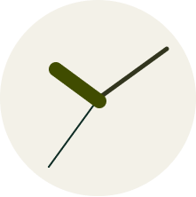
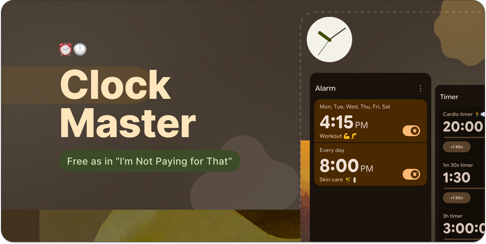
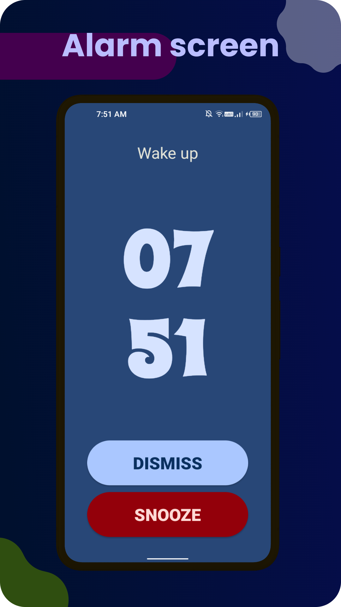
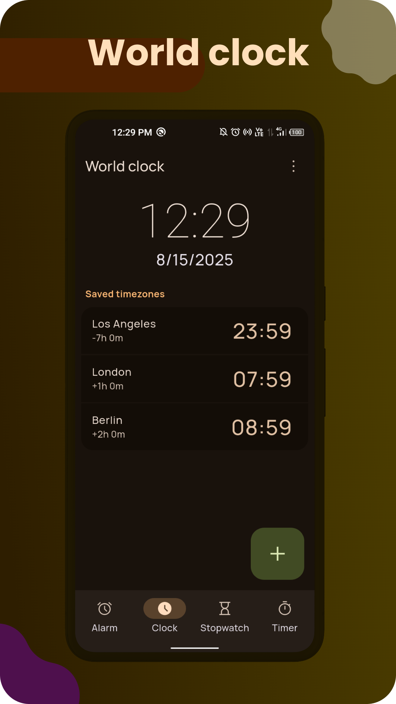
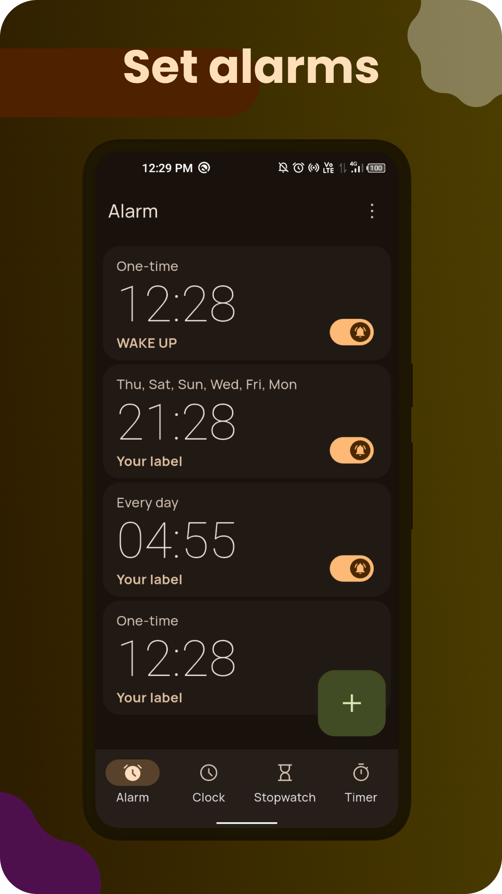
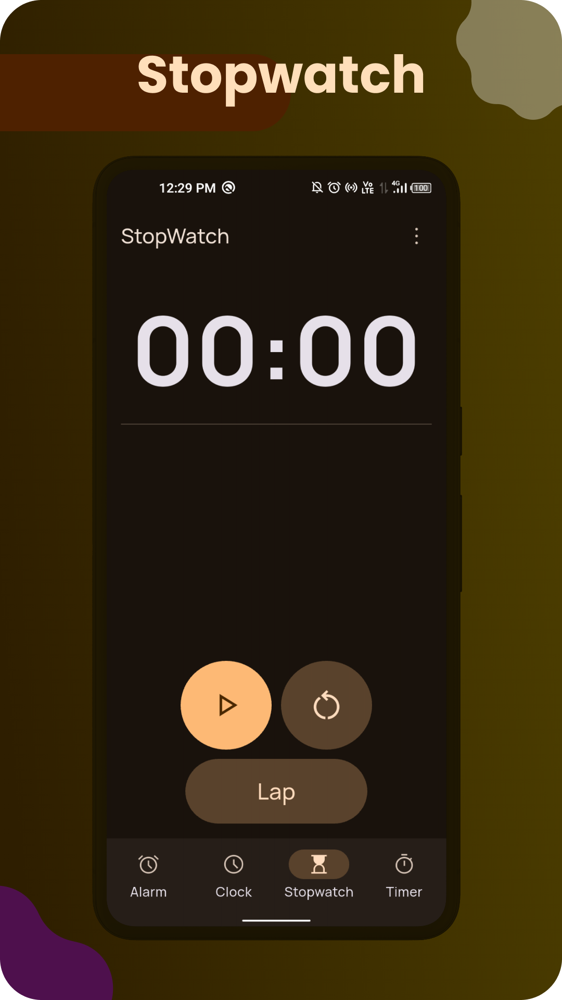
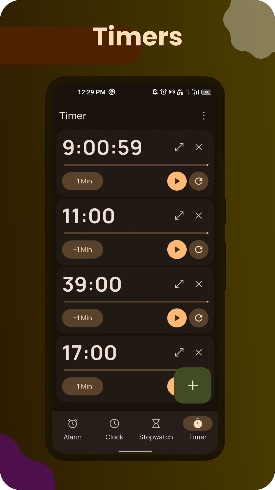
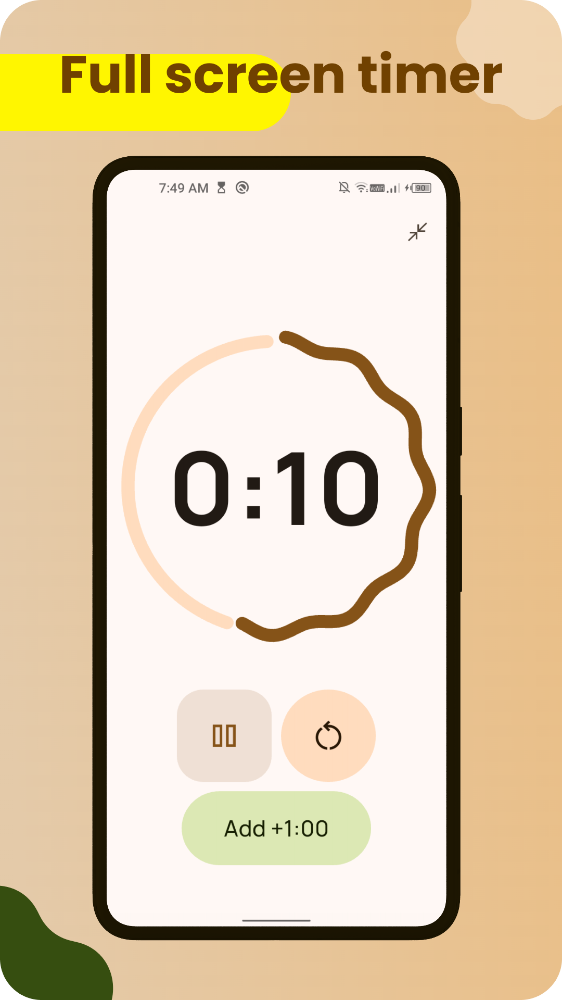

   

<h1 align="center">
 ClockMaster
</h1>
   

      
      
       
      
       
       

</a>
   

 

    
  [Contact](https://github.com/PranshulGG/WeatherMaster?tab=readme-ov-file#contact) • [License](https://github.com/PranshulGG/WeatherMaster?tab=readme-ov-file#license) • [Translate](https://github.com/PranshulGG/WeatherMaster?tab=readme-ov-file#-translate-the-app-on-crowdin)
   
 

    

 
   

 

# 👁️ Screenshots

 

# ✉️ Contact

For any questions or feedback, feel free to open an issue on GitHub or contact pranshul.devmain@gmail.com

# ©️ License

This project is licensed under the GPL-3.0 license. See the `LICENSE` file for details.
